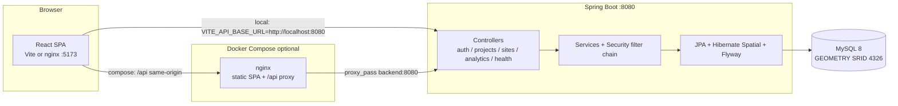

# Darukaa.Earth

Environmental intelligence for restoration projects: sites, spatial context, and analytics in one place.

This repository is a **hiring-track hackathon submission**.
**Demo login (must be changed before any shared deploy):** `admin@darukaa.earth` / `ChangeMe_Admin_123!`

---

## Stack decision: Java Spring Boot + MySQL spatial (not Python/PostGIS)

The original Darukaa.Earth challenge specified **React + Mapbox + a Python backend + PostgreSQL/PostGIS**.

This submission **intentionally does not follow that backend/database pairing**. It uses:

| Challenge prompt | This repository |
| --- | --- |
| Python backend | **Java 17 + Spring Boot 3.3** (`com.darukaa.earth`) |
| PostgreSQL / PostGIS | **MySQL 8** built-in `GEOMETRY` **SRID 4326** |
| React + Mapbox | React 18 + Vite + Mapbox GL JS (kept) |

**Why.** The hiring track is a Spring layered architecture (controllers → services → JPA repositories, Flyway-owned schema, Spring Security). MySQL 8 spatial types store real polygons via **Hibernate Spatial** and JTS — not JSON blobs and not a WKT `VARCHAR`. The HTTP contract is **GeoJSON in and GeoJSON out**, so the React client stays GIS-engine agnostic: it never speaks PostGIS SQL or MySQL WKT.

This document does **not** claim Python or PostGIS compliance.

A public Mapbox token from [account.mapbox.com](https://account.mapbox.com/) (`VITE_MAPBOX_TOKEN`) is required for the map. Set a long random `JWT_SECRET` before sharing the environment.

---

## Product overview

Darukaa.Earth is a small full-stack app for ecological restoration work in an Indian landscape context. An authenticated operator can:

- register or sign in (JWT)
- create and filter restoration **projects**
- draw **site polygons** on a Mapbox map
- review **monthly analytics** charts

The API is Spring Boot on port **8080**. The SPA is Vite (local) or nginx (Compose) on port **5173**. Persistence is MySQL 8. Flyway owns DDL (`V1`–`V6`); Hibernate only **validates** entities (`ddl-auto=validate`).

Seeded charts are **generated demo series**, not field measurements. See [Dataset / mock data](#dataset--mock-data).

---

## Problem statement

Restoration programs need a single place to answer: which projects exist, where the sites are, and how headline metrics move over time. Spreadsheets and GIS files do not share a login, a REST contract, or a map.

This demo shows that loop end to end: JWT session, project CRUD, GeoJSON polygon storage, and Chart.js summaries — with explicit mock data so reviewers are not asked to treat the numbers as sensors.

---

## Key features

- **JWT auth** — register, login, `/api/auth/me`; BCrypt password hashes; every new account is `ADMIN` for the demo
- **Project catalog** — CRUD plus filters `status`, `projectType`, `name`
- **Sites** — Mapbox Draw polygons saved as GeoJSON; list-all is a GeoJSON FeatureCollection
- **MySQL spatial** — `GEOMETRY` SRID 4326 via Hibernate Spatial + JTS (not PostGIS)
- **Analytics** — EAV rows pivoted to `{ carbonValue, biodiversityScore, vegetationIndex, performanceScore }`; dashboard and `/analytics` call `GET /api/analytics/summary`
- **Generated Indian demo seed** — five mock projects (Western Ghats, Sundarbans, Nilgiris, Chilika, Kaziranga) when `APP_SEED_DEMO=true`
- **Quality + CI** — ESLint, Prettier, Husky, Spotless, Vitest, Maven tests, GitHub Actions (verify only)

---

## Screenshots

_Add PNG/WebP files under `docs/screenshots/` and link them here before a public submission. Suggested captions:_

| Suggested file | Caption |
| --- | --- |
| `docs/screenshots/login.png` | Sign-in at `/login` with the demo admin account |
|  

 | Dashboard counts and Average Performance  |
| 
  


 | Project list and create form |
|   


 | Mapbox with intensive precision |
|  

 | Chart.js monthly series on Analytics|

Without `VITE_MAPBOX_TOKEN`, `/map` shows the in-app “Mapbox token is not configured” empty state instead of a map.

---

## Architecture

```text
Browser (React SPA)
  → Axios + Bearer JWT (localStorage key darukaa.auth.token)
    → REST /api/*  (Spring Boot 3.3, package com.darukaa.earth)
      → JPA + Flyway
        → MySQL 8 (GEOMETRY SRID 4326)
```

**Local hybrid:** Vite `:5173` talks to the API at `http://localhost:8080` (CORS). Vite also proxies `/api` → `8080` if the SPA uses a relative base.

**Docker Compose:** browser → **nginx :5173** → `/api` reverse proxy → **backend :8080** → **mysql**. The SPA is built with `VITE_API_BASE_URL=/api` so the browser stays same-origin.

Layers and sequence diagrams: [`docs/architecture.md`](docs/architecture.md). Tables and spatial notes: [`docs/schema.md`](docs/schema.md).

There is **no user↔project foreign key**. Authenticated users share one catalog. That is a demo trade-off, not multi-tenant isolation.

---

## Technology stack

| Layer | Choice | Notes |
| --- | --- | --- |
| Frontend | React 18, Vite 6, TypeScript, React Router 6 | SPA routes behind `ProtectedRoute` |
| HTTP client | Axios | Bearer interceptor; 401 clears the session |
| Map | Mapbox GL JS + `@mapbox/mapbox-gl-draw` | Public `pk.` token baked at Vite **build** time |
| Charts | Chart.js + `react-chartjs-2` | `/analytics` and dashboard |
| Backend | Java 17, Spring Boot **3.3.5**, Maven Wrapper | `com.darukaa.earth.*` |
| Security | Spring Security 6, JJWT 0.12.6, BCrypt (strength 10) | Stateless JWT |
| Persistence | Spring Data JPA, Flyway, Hibernate Spatial, JTS 1.19 | MySQL dialect (spatial merged in Hibernate 6) |
| Database | **MySQL 8.0** `GEOMETRY` SRID 4326 | **Not** PostGIS |
| Containers | Docker Compose, nginx Alpine, Temurin 17 JRE | Full stack or MySQL-only |
| Tests | JUnit + MockMvc + Testcontainers MySQL; Vitest + Testing Library | Persistence tests skip without Docker |
| Quality | ESLint 9, Prettier, Husky, lint-staged, Spotless (Google Java Format AOSP) | Root `npm install` registers hooks |
| CI | GitHub Actions, two jobs, **no deploy job** | [`.github/workflows/ci.yml`](.github/workflows/ci.yml) |

---

## System architecture diagram



Public: `GET /api/health`, `POST /api/auth/register`, `POST /api/auth/login`. Everything else under `/api/projects`, `/api/sites`, `/api/analytics`, and `/api/auth/me` requires `Authorization: Bearer <token>`.

---

## Database schema

MySQL 8 relational model. **Not PostGIS.** Polygons live in `sites.geometry` as `GEOMETRY NOT NULL SRID 4326` with a spatial index.

```text
users  (no FK to projects)
projects 1 ──< sites 1 ──< analytics
```

Flyway scripts `V1`–`V6` create users, projects, sites, analytics, project dates, and site description. Column-level detail, indexes, and the area formula: **[`docs/schema.md`](docs/schema.md)**.

---

## API overview

Base URL local: `http://localhost:8080`. Compose (via nginx): `http://localhost:5173/api/...`.

| Method | Path | Auth | Role |
| --- | --- | --- | --- |
| GET | `/api/health` | Public | `{ "status": "UP", "service": "darukaa-earth" }` |
| GET | `/actuator/health`, `/actuator/info` | Public | Actuator; health details hidden |
| POST | `/api/auth/register` | Public | `201` + JWT; new users are `ADMIN` |
| POST | `/api/auth/login` | Public | `200` + JWT |
| GET | `/api/auth/me` | JWT | Current user |
| POST | `/api/projects` | JWT | Create |
| GET | `/api/projects` | JWT | Optional `?status=&projectType=&name=` |
| GET | `/api/projects/{id}` | JWT | Includes `siteCount` |
| PUT | `/api/projects/{id}` | JWT | Update |
| DELETE | `/api/projects/{id}` | JWT | `204`; sites cascade |
| POST | `/api/projects/{projectId}/sites` | JWT | GeoJSON Polygon body |
| GET | `/api/projects/{projectId}/sites` | JWT | Site list for one project |
| GET | `/api/sites` | JWT | **GeoJSON FeatureCollection** (map) |
| GET | `/api/sites/{id}` | JWT | One site |
| PUT | `/api/sites/{id}` | JWT | Update polygon + metadata |
| DELETE | `/api/sites/{id}` | JWT | `204`; analytics cascade |
| GET | `/api/sites/{siteId}/analytics` | JWT | Optional `from` / `to` (`yyyy-MM-dd`) |
| GET | `/api/analytics/summary` | JWT | Averages + `monthlyAverages` + `demoData` |
| GET | `/api/analytics/overview` | JWT | Monthly average points only |

JSON errors look like `{ status, error, message, path, details, fieldErrors }` (`com.darukaa.earth.exception.ApiError`). Controllers do not return stack traces.

**Enums:** `projectType` = `BIODIVERSITY` \| `CARBON` \| `REFORESTATION` \| `WATERSHED` \| `COASTAL`. `status` = `ACTIVE` \| `PLANNING` \| `COMPLETED` \| `ON_HOLD`.

---

## Authentication approach

| Piece | Implementation |
| --- | --- |
| Passwords | BCrypt, strength 10 (`SecurityConfig`) |
| Tokens | JJWT HMAC; secret is SHA-256-derived in `JwtService` |
| Default lifetime | `JWT_EXPIRATION_MS=86400000` (24 hours) |
| Filter | `JwtAuthenticationFilter` reads `Authorization: Bearer …` |
| Roles | `UserRole.ADMIN` / `USER`. **Register always assigns `ADMIN`** so the demo can manage projects without a promote step |
| Seed admin | `AdminUserSeeder` creates `admin@darukaa.earth` when `APP_ADMIN_SEED=true` |

Claims on the token: `sub` (email), `userId`, `name`, `role`.

**localStorage caveat.** The SPA stores the JWT in `localStorage` under `darukaa.auth.token` (`frontend/src/auth/tokenStorage.ts`). Any XSS on the origin can read it. That is acceptable for this hackathon; production should use **HttpOnly cookies** (or a BFF) and a hardened CSP.

A 401 on a non-login request clears the token and sends the user to `/login` with a session-expired notice. Login/register 401s do not loop. Duplicate email returns **409**.

Local `JWT_SECRET` defaults to `change-me-in-production`. Set a long random value before sharing. `JWT_FAIL_ON_WEAK_SECRET=true` refuses to start on that default.

---

## Geospatial implementation

The map talks **GeoJSON only**. The database is **MySQL spatial, not PostGIS**.

```text
Mapbox Draw polygon
  → GeoJSON Polygon [lng, lat]
    → GeometryConverter (unwrap Feature if needed)
      → JTS org.locationtech.jts.geom.Polygon
        → Hibernate Spatial @JdbcTypeCode(GEOMETRY)
          → MySQL GEOMETRY SRID 4326
            → response GeoJSON + centroid + area_sq_km
```

- Accepts a GeoJSON **Polygon** or a **Feature** wrapping a Polygon. Point / LineString → **400**.
- Rings must be closed with at least four positions. Coordinates are WGS84 longitude, latitude.
- Persistence uses Hibernate Spatial **WKB**, not `ST_GeomFromText` (MySQL 8 `ST_GeomFromText(..., 4326)` uses lat/lon axis order; JTS/GeoJSON are lon/lat).
- Centroid and `area_sq_km` are derived in `GeometryUtils` (spherical trapezoidal formula, mean Earth radius 6371.0088 km) — an estimate for small plots, not a geodesic equal-area projection.
- `GET /api/sites` returns a FeatureCollection so Mapbox can `setData` directly.

---

## Analytics approach

Storage is **EAV**: table `analytics` has `(site_id, metric_date, metric_name, metric_value, unit)` with a unique key on site + date + name.

Canonical names (`AnalyticsMetrics`): `carbon` (tCO2e), `biodiversity` (score), `vegetation` (NDVI), `performance` (score).

`AnalyticsMapper` groups rows by date and **pivots** them into DTO fields `carbonValue`, `biodiversityScore`, `vegetationIndex`, `performanceScore`.

The SPA’s dashboard and `/analytics` page call **`GET /api/analytics/summary`**. That payload includes `totalSites`, four averages, `monthlyAverages`, and `demoData: true` (always true in this phase — series are mock). Chart.js (`AnalyticsChart`) renders line/bar charts. Site detail can also load `GET /api/sites/{id}/analytics`.

---

## Dataset / mock data

**This is generated demo data, not field measurements, satellite products, or sensor readings.** Charts and the Average Performance card are labeled Demo data in the UI.

When `APP_SEED_DEMO=true` (local and Compose default; **false** in tests), `DemoDataSeeder` inserts five **Indian ecological example** projects if the marker name `Western Ghats Restoration Corridor` is absent:

| Project | Type | Example sites (mock polygons) |
| --- | --- | --- |
| Western Ghats Restoration Corridor | REFORESTATION | Silent Valley buffer, Anamalai foothills, Agasthyamalai ridge |
| Sundarbans Mangrove Recovery | COASTAL | Sajnekhali creek, Basanti mudflat |
| Nilgiri Shola Conservation | BIODIVERSITY | Ooty shola patch, Coonoor ridge, Kotagiri grassland |
| Chilika Lake Catchment | WATERSHED | Nalabana island fringe, Satpada channel |
| Kaziranga Floodplain Restoration | CARBON | Kohora grassland, Bagori woodland, Agoratoli wetland, Panbari corridor |

Each site gets ~12 monthly rows (from 2025-10) for the four metrics. Values are plausible mock series (`sin` seasonality + site seed), not observations.

Disable: `APP_SEED_DEMO=false`. Idempotent: if the Western Ghats marker project exists, the seeder skips.

---

## Local setup

| Tool | Version |
| --- | --- |
| JDK | **17** |
| Node.js | **20+** |
| Maven | Wrapper in `backend/` (`mvnw` / `mvnw.cmd`); 3.9+ if you use a system Maven |
| Docker Desktop | Required for MySQL and for `MysqlPersistenceTest` (Testcontainers) |
| Mapbox | Public token from [account.mapbox.com](https://account.mapbox.com/) |

Clone the repo, then install Git hooks and frontend deps:

**PowerShell**

```powershell
cd C:\Users\USER\DarukaEarth
copy .env.example .env
copy frontend\.env.example frontend\.env
# Edit frontend\.env — set VITE_MAPBOX_TOKEN=pk.... from account.mapbox.com
npm install
cd frontend
npm install
```

**Unix**

```bash
cd /path/to/DarukaEarth
cp .env.example .env
cp frontend/.env.example frontend/.env
# Edit frontend/.env — set VITE_MAPBOX_TOKEN
npm install
cd frontend && npm install
```

Start MySQL, then the API and SPA (next two sections). Do not run the **full** Compose stack and host `mvnw` / `npm run dev` at the same time — ports **8080** and **5173** will clash.

---

## Environment variables

Never commit real `.env` files (ignored by git). Copy from the example files.

### Root `.env` (Docker Compose)

From [`.env.example`](.env.example):

| Variable | Example / default | Purpose |
| --- | --- | --- |
| `MYSQL_ROOT_PASSWORD` | `darukaa_root_dev` | MySQL root (local only) |
| `MYSQL_DATABASE` | `darukaa_earth` | Database name |
| `MYSQL_USER` / `MYSQL_PASSWORD` | `darukaa` / `darukaa_dev` | App user |
| `MYSQL_PORT` | `3306` | Published MySQL port |
| `JWT_SECRET` | `change-me-in-production` | **Set a long random value before sharing** |
| `JWT_EXPIRATION_MS` | `86400000` | Access token lifetime |
| `JWT_FAIL_ON_WEAK_SECRET` | `false` | Set `true` to refuse the default secret |
| `APP_ADMIN_EMAIL` | `admin@darukaa.earth` | Seed admin |
| `APP_ADMIN_PASSWORD` | `ChangeMe_Admin_123!` | **Change this** |
| `APP_SEED_DEMO` | `true` | Generated Indian mock projects |
| `JAVA_OPTS` | empty | e.g. `-Xms256m -Xmx512m` |
| `FRONTEND_PORT` / `BACKEND_PORT` | `5173` / `8080` | Published ports |
| `VITE_API_BASE_URL` | `/api` | Compose image only (nginx proxy). Do not use `http://localhost:8080` here |
| `VITE_MAPBOX_TOKEN` | `your_mapbox_public_token` | Public `pk.` token; **rebuild** the frontend image after changing |

Compose also passes `APP_ADMIN_SEED`, `APP_ADMIN_NAME`, and `APP_CORS_ALLOWED_ORIGINS` (see `docker-compose.yml`).

### `backend/.env.example` (host `mvnw`)

Spring reads placeholders in `application.yml`. Useful locals: `SERVER_PORT=8080`, `APP_CORS_ALLOWED_ORIGINS=http://localhost:5173`, `MYSQL_HOST=localhost` (Compose sets `MYSQL_HOST=mysql` inside the backend container), plus the JWT and admin seed variables above. `APP_SEED_DEMO` is read from the environment even if it is listed in the root example file rather than `backend/.env.example`.

### `frontend/.env.example` (host `npm run dev`)

| Variable | Local value |
| --- | --- |
| `VITE_API_BASE_URL` | `http://localhost:8080` |
| `VITE_MAPBOX_TOKEN` | your `pk.` token from account.mapbox.com |

Vite inlines `VITE_*` at **build** time. Changing the Mapbox token requires restarting `npm run dev` or `docker compose up --build`.

---

## Running the backend

Start MySQL first:

```powershell
cd C:\Users\USER\DarukaEarth
docker compose up -d mysql
cd backend
.\mvnw.cmd spring-boot:run
```

```bash
docker compose up -d mysql
cd backend
./mvnw spring-boot:run
```

On startup Flyway applies `V1`–`V6`. Hibernate then validates entities. With defaults, `AdminUserSeeder` and `DemoDataSeeder` run.

Optional profile:

```powershell
.\mvnw.cmd spring-boot:run "-Dspring-boot.run.profiles=dev"
```

Health **without** MySQL (API-only smoke; auth/projects/sites/analytics beans are off):

```powershell
.\mvnw.cmd spring-boot:run "-Dspring-boot.run.profiles=nodb"
```

API: http://localhost:8080/api/health

### Quick JWT check (PowerShell)

```powershell
Invoke-RestMethod -Method Post -Uri http://localhost:8080/api/auth/login -ContentType "application/json" -Body '{"email":"admin@darukaa.earth","password":"ChangeMe_Admin_123!"}'
```

```bash
curl -s -X POST http://localhost:8080/api/auth/login \
  -H "Content-Type: application/json" \
  -d '{"email":"admin@darukaa.earth","password":"ChangeMe_Admin_123!"}'
```

Use the returned `token` as `Authorization: Bearer <token>` on project, site, and analytics routes.

---

## Running the frontend

```powershell
cd C:\Users\USER\DarukaEarth\frontend
copy .env.example .env
# Set VITE_MAPBOX_TOKEN
npm install
npm run dev
```

```bash
cd frontend
cp .env.example .env
npm install
npm run dev
```

Vite: http://localhost:5173 (port **5173** in `vite.config.ts`). Unauthenticated visits go to `/login`. Live data needs MySQL + `spring-boot:run`.

App routes: `/dashboard`, `/projects`, `/projects/:id`, `/map`, `/sites/:id`, `/analytics`.

---

## Docker setup

Request path: **browser → nginx (published 5173 → container 80) → `/api` proxy → Spring Boot `backend:8080` → MySQL**. nginx `try_files` serves the SPA for client-side routing.

**PowerShell**

```powershell
cd C:\Users\USER\DarukaEarth
copy .env.example .env
# Set JWT_SECRET, APP_ADMIN_PASSWORD, and VITE_MAPBOX_TOKEN
docker compose up --build
```

**Unix**

```bash
cp .env.example .env
docker compose up --build
```

Open http://localhost:5173 . Public health: http://localhost:5173/api/health or http://localhost:8080/api/health.

`VITE_MAPBOX_TOKEN` is a **build-arg**. Changing it requires `docker compose up --build` again (a restart without rebuild keeps the old token).

Hybrid (MySQL only): `docker compose up -d mysql`, then host `mvnw` and `npm run dev`.

If Docker is not installed, the Dockerfiles are still valid — install Docker Desktop, then run the commands above.

---

## Testing

**Backend** (from `backend/`):

```powershell
cd C:\Users\USER\DarukaEarth\backend
.\mvnw.cmd test
```

```bash
./mvnw test
```

Health and geometry unit tests do not need Docker. `MysqlPersistenceTest` uses Testcontainers MySQL 8 and **skips if Docker is not running**. Tests set `app.seed.demo=false` and do not seed the admin user.

**Frontend** (from `frontend/`):

```powershell
cd C:\Users\USER\DarukaEarth\frontend
npm test
```

Vitest (`vitest run`) with jsdom. No Mapbox token is required.

---

## Code quality

Git hooks live at the **repo root**. `npm install` there registers Husky; `frontend` `npm install` provides ESLint/Prettier binaries. `pre-commit` runs `npx lint-staged` (eslint --fix + Prettier on staged `frontend/**` JS/TS/TSX; Prettier on CSS/JSON).

| Command | Where | What |
| --- | --- | --- |
| `npm run lint` | `frontend/` or repo root | ESLint |
| `npm run format` | `frontend/` or repo root | Prettier write |
| `npm run format:check` | `frontend/` or repo root | Prettier check (CI) |
| `npm test` | `frontend/` | Vitest |
| `npm run build` | `frontend/` | `tsc -b && vite build` |
| `.\mvnw.cmd test` / `./mvnw test` | `backend/` | Unit + integration tests |
| `.\mvnw.cmd verify` / `./mvnw verify` | `backend/` | Tests + **Spotless check** |
| `.\mvnw.cmd spotless:apply` | `backend/` | Google Java Format AOSP |

If `verify` fails on style, run `spotless:apply` once, then `verify` again.

---

## CI/CD pipeline

Push or open a pull request: [`.github/workflows/ci.yml`](.github/workflows/ci.yml). **Two jobs** run in parallel on `ubuntu-latest`. There is **no deploy job** (no registry credentials in this repository).

| Job | Runs |
| --- | --- |
| **Frontend** | Node 20, `npm ci`, `lint`, `format:check`, `test`, `build` (`CI=true`) |
| **Backend** | Java 17 Temurin, `./mvnw -B -q verify` (tests + Spotless) |

GitHub-hosted Ubuntu runners have Docker, so Testcontainers MySQL usually runs in CI. Locally those tests skip without Docker.

After the repo is on GitHub, results appear on the **Actions** tab.

---

## Deployment

Treat **Docker Compose as the demo deploy**: same file on a laptop or a small VPS. Set real secrets in `.env` (never the sample values):

- `JWT_SECRET` — long random string
- `APP_ADMIN_PASSWORD` — change the demo admin password
- `VITE_MAPBOX_TOKEN` — Mapbox public token (map will not render without it; rebuild frontend)
- MySQL user/password/database (`MYSQL_HOST` when the API is not on Compose DNS `mysql`)

Useful: `APP_SEED_DEMO=true` for the mock Indian projects; `JAVA_OPTS` for heap; `JWT_FAIL_ON_WEAK_SECRET=true` before a shared environment.

Platforms that run one process per service (Render, Railway, Fly) can point `MYSQL_HOST` at a managed MySQL, set the API env vars, and either put nginx in front or build the frontend with `VITE_API_BASE_URL` set to the public API origin.

**Not production-hardened:** HTTPS/TLS, a secrets manager, locking down published MySQL/8080 ports, image scanning, and a GitHub deploy job are **future work**. This is a local/demo stack.

---

## Trade-offs

| Choice | Why | Cost |
| --- | --- | --- |
| Java/MySQL instead of Python/PostGIS | Spring hiring track; MySQL 8 spatial + GeoJSON API | Does not match the original challenge stack letter-for-letter |
| All registrants are `ADMIN` | Demo can CRUD without a promote flow | No real RBAC |
| No `users`→`projects` FK | Faster catalog demo | No per-user isolation |
| JWT in `localStorage` | Simple SPA session | XSS can steal the token |
| EAV analytics + pivot DTO | Flexible metric names; Chart.js wants columns | Extra mapping layer |
| Spherical trapezoid area | Fast, good enough for small plots | Not a geodesic equal-area projection |
| Seeded mock series | Charts work without sensors | Must be labeled demo data |
| Compose as “deploy” | Reproducible demo | No TLS, no CD |
| Mapbox public token at build time | Standard Vite pattern | Rebuild to rotate the token |

---

## Future improvements

- Per-user (or org) project ownership and real `USER` vs `ADMIN` authorization
- HttpOnly cookie session (or BFF) instead of `localStorage` JWT
- HTTPS, secrets manager, locked-down ports, image scanning
- GitHub Actions **deploy** job once registry credentials exist
- Optional PostGIS (or keep MySQL) with true geodesic area and topology checks
- Ingest real remote-sensing / field time series; keep `demoData` false when that happens
- Site update/delete UI (API already has `PUT`/`DELETE /api/sites/{id}`)
- Refresh tokens and shorter access-token TTL
- MultiPolygon and upload of existing GeoJSON files

---

## Further reading

- Architecture (flows, mermaid, packages): [`docs/architecture.md`](docs/architecture.md)
- Schema (tables, spatial notes): [`docs/schema.md`](docs/schema.md)
- Compose: [`docker-compose.yml`](docker-compose.yml)
- CI: [`.github/workflows/ci.yml`](.github/workflows/ci.yml)
