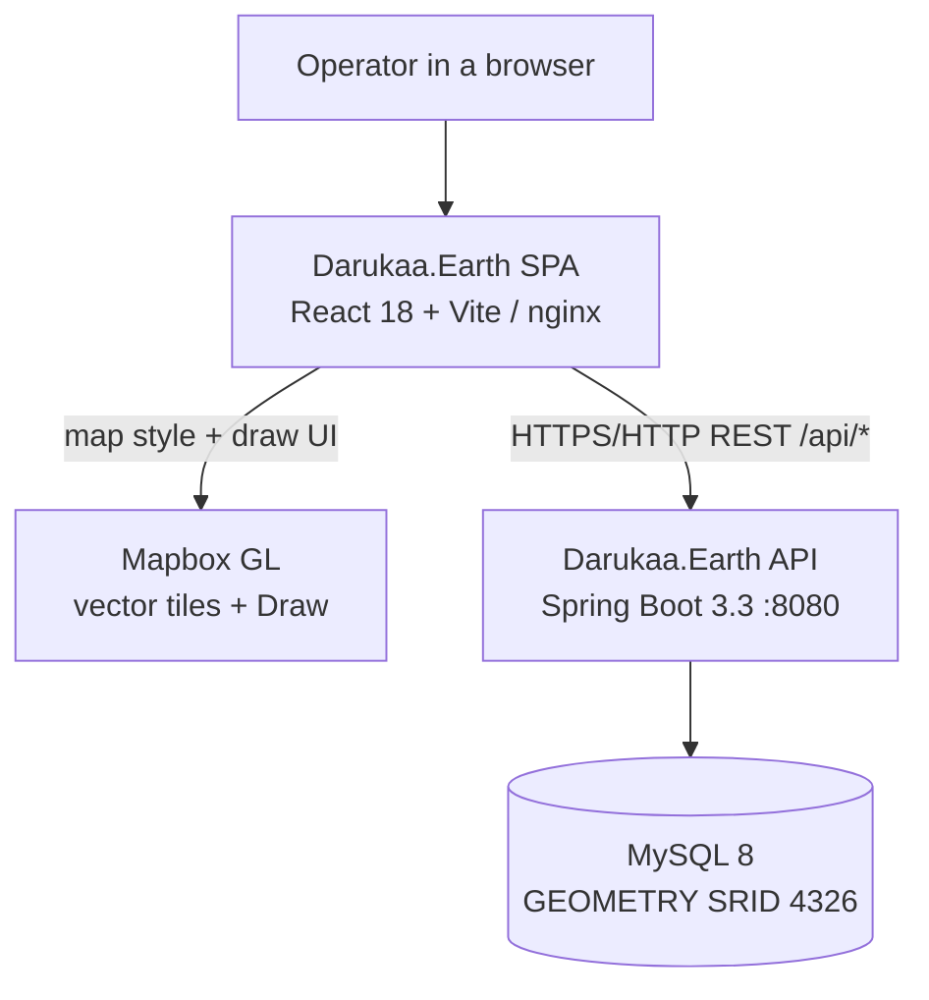
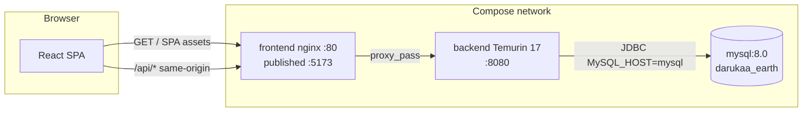
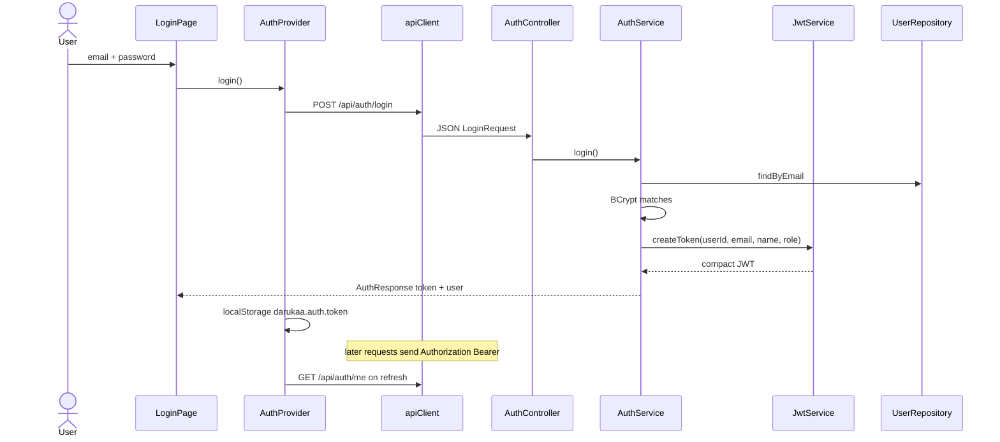
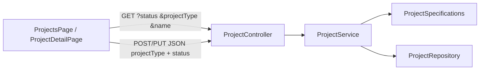
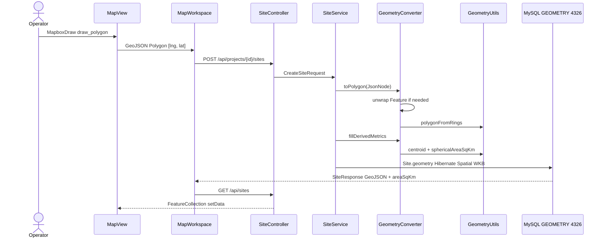
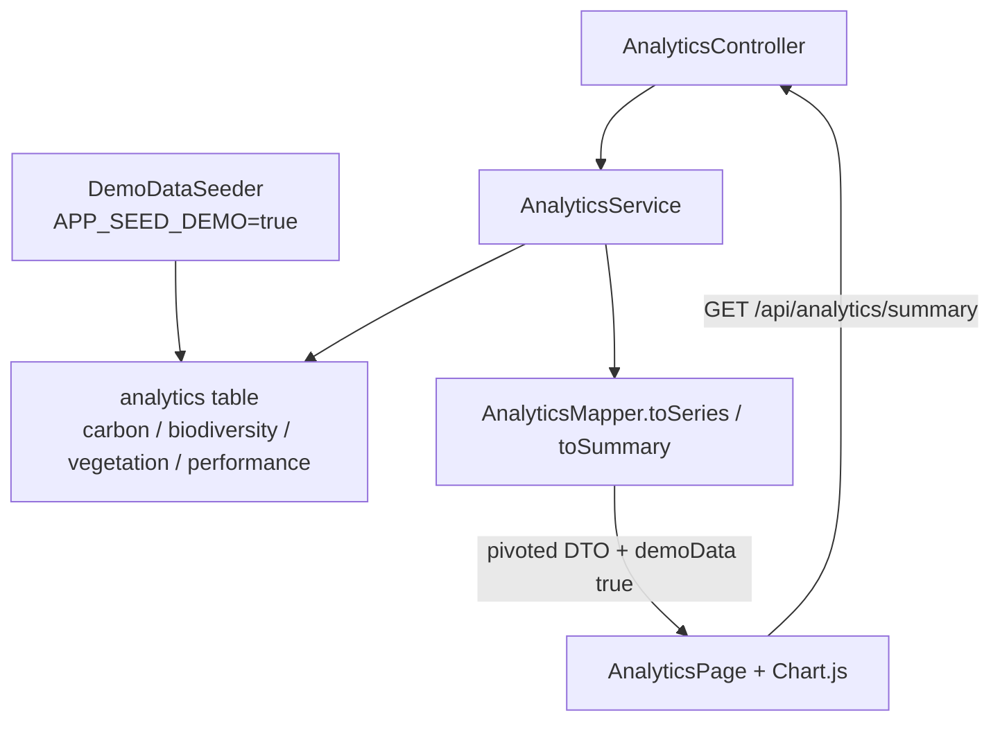
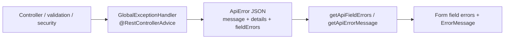
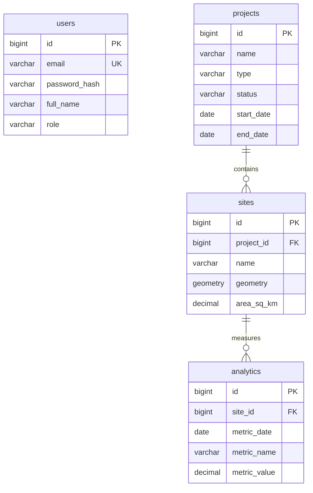
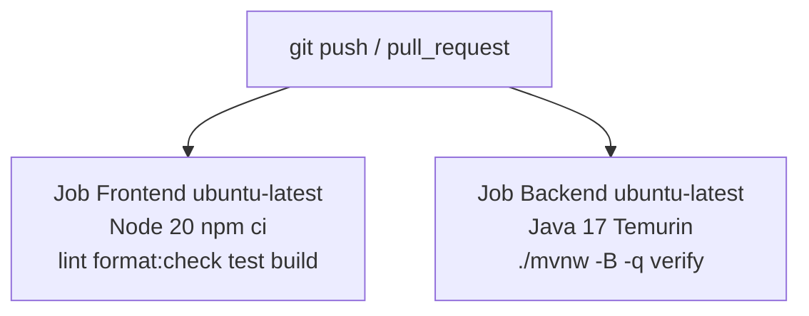

# Darukaa.Earth architecture

How the running system is wired. Package names match `com.darukaa.earth.*`. Table-level SQL lives in [`schema.md`](schema.md).

This stack is **Java Spring Boot + MySQL 8 spatial**, not Python + PostGIS. The HTTP contract is GeoJSON, so the React client does not depend on a particular GIS engine. See the README section **Stack decision: Java Spring Boot + MySQL spatial (not Python/PostGIS)**.

---

## System context



The SPA never opens a database connection. Mapbox only renders and captures polygons; persistence is entirely the API.

---

## Containers

Two ways to run the same containers of logic:

**Local hybrid** — Docker runs only MySQL. The API is `./mvnw spring-boot:run` (or `.\mvnw.cmd`) on the host. Vite serves the SPA on `:5173` with `VITE_API_BASE_URL=http://localhost:8080` (CORS via `app.cors.allowed-origins`). `vite.config.ts` also proxies `/api` → `http://localhost:8080`.

**Compose** — three services in [`docker-compose.yml`](../docker-compose.yml): `mysql`, `backend`, `frontend` (nginx). The SPA is built with `VITE_API_BASE_URL=/api`. nginx `proxy_pass`es `/api` to `http://backend:8080` (`frontend/nginx.conf`).



Do not run Compose `frontend`/`backend` and host Vite/`mvnw` together: published ports **5173** and **8080** collide.

---

## Backend packages

Entry point: `com.darukaa.earth.DarukaaEarthApplication`.

| Package | Responsibility |
| --- | --- |
| `com.darukaa.earth.health` | Public `HealthController` → `GET /api/health` |
| `com.darukaa.earth.auth` | `AuthController`, `AuthService`, `JwtService` |
| `com.darukaa.earth.security` | `SecurityConfig`, `JwtAuthenticationFilter`, `AdminUserSeeder`, JSON 401/403 handlers |
| `com.darukaa.earth.user` | `User` entity, `UserRole`, `UserRepository` |
| `com.darukaa.earth.project` | `ProjectController` → `ProjectService` → `ProjectRepository` / `ProjectSpecifications` |
| `com.darukaa.earth.site` | `SiteController` → `SiteService` → `GeometryConverter` / `GeometryUtils` |
| `com.darukaa.earth.analytics` | `AnalyticsController` → `AnalyticsService` → `AnalyticsMapper`; `DemoDataSeeder` |
| `com.darukaa.earth.exception` | `GlobalExceptionHandler` (`@RestControllerAdvice`), `ApiError` |
| `com.darukaa.earth.common` | Shared JPA auditing (`AuditedEntity`) |
| `com.darukaa.earth.config` | `WebConfig` CORS mappings for `/api/**` (in addition to `SecurityConfig`'s `CorsConfigurationSource`) |

Auth, project, site, and analytics controllers are `@Profile("!nodb")`. The `nodb` profile is health-only (no DataSource / Flyway).

Typical call chain:

```text
Controller  →  Service  →  Mapper / Converter  →  Spring Data repository  →  MySQL
```

Flyway owns DDL (`classpath:db/migration`, `V1`–`V6`). `spring.jpa.hibernate.ddl-auto=validate`.

---

## Frontend structure

| Area | Path / type |
| --- | --- |
| Routes | `frontend/src/App.tsx` — `GuestRoute` (`/login`, `/register`), `ProtectedRoute` (app shell) |
| Session | `AuthProvider`, `tokenStorage` (`darukaa.auth.token`) |
| HTTP | `apiClient` (Axios) + `authApi`, `projectApi`, `siteApi`, `analyticsApi`, `healthApi` |
| Map | `MapPage` → lazy `MapWorkspace` → `MapView` (Mapbox Draw) |
| Charts | `AnalyticsPage` / dashboard → `getAnalyticsSummary` → `AnalyticsChart` (Chart.js) |
| Errors | `getApiErrorMessage` / `getApiFieldErrors` map `ApiError.fieldErrors` onto forms |

App routes: `/dashboard`, `/projects`, `/projects/:id`, `/map`, `/sites/:id`, `/analytics`. `/` redirects to `/dashboard`.

---

## Authentication flow

Passwords are BCrypt (strength 10). Tokens are JJWT HMAC; `JwtService` derives the key with SHA-256 of `JWT_SECRET`. Register always persists `UserRole.ADMIN` so the demo can call management APIs without a promote step.



`JwtAuthenticationFilter` runs before `UsernamePasswordAuthenticationFilter`. Missing/invalid Bearer tokens leave the security context empty; protected matchers then return JSON 401 via `JsonAuthenticationEntryPoint`.

`AdminUserSeeder` (`APP_ADMIN_SEED=true`) inserts `admin@darukaa.earth` if missing. Change `APP_ADMIN_PASSWORD` before sharing.

**XSS caveat:** `localStorage` is readable by any script on the origin. Production should move to HttpOnly cookies.

---

## Project management

`ProjectController` (`/api/projects`) is JWT-only. There is **no owner column** — every authenticated user sees the same catalog.



`ProjectMapper` maps JSON `projectType` to column `type`. `endDate` must be on or after `startDate` (`InvalidRequestException` → 400). Delete cascades to sites (and their analytics) via JPA/`ON DELETE CASCADE`. `siteCount` is computed on read, not stored.

---

## Site management

Create/list-by-project hang off the project: `POST|GET /api/projects/{projectId}/sites`. The map uses `GET /api/sites` (FeatureCollection). Item APIs are `/api/sites/{id}`.

The SPA create path is draw-then-save (`MapWorkspace.handleCreate` → `siteApi.create`). Backend also exposes `PUT` and `DELETE` on `/api/sites/{id}`; the current UI focuses on create + inspect.

---

## Geospatial data flow

Draw → GeoJSON → JTS → MySQL `GEOMETRY` → GeoJSON. **Not PostGIS.**



`GeometryConverter` rejects non-Polygon types and invalid WGS84 ranges (`InvalidPolygonException` → 400). Axis-order note: JTS/GeoJSON are **lon/lat**; MySQL `ST_GeomFromText(..., 4326)` is lat/lon — this code persists via Hibernate Spatial WKB, not that function. Area is a spherical trapezoid (radius 6371.0088 km), suitable for small demo plots.

---

## Analytics data flow

Seed writes **EAV** rows (`AnalyticsRecord`: one row per metric name per date). The API pivots them for Chart.js.



`GET /api/sites/{siteId}/analytics` optional `from`/`to` (`ISO DATE`). `GET /api/analytics/overview` is the monthly-average list without the headline totals. `AnalyticsSummaryResponse.demoData` is always `true` in this phase.

Seeded values are **generated mock series**, not field measurements. Marker project: `Western Ghats Restoration Corridor`. Details in the README dataset section and [`schema.md`](schema.md).

---

## Error handling



`GlobalExceptionHandler` maps:

| Exception | HTTP |
| --- | --- |
| `MethodArgumentNotValidException` / `ConstraintViolationException` | 400 + `fieldErrors` |
| `InvalidRequestException` / `InvalidPolygonException` / unreadable JSON | 400 |
| `DuplicateEmailException` | 409 |
| `ResourceNotFoundException` / missing static resource | 404 |
| `BadCredentialsException` | 401 “Invalid email or password” |
| other `AuthenticationException` | 401 |
| `AccessDeniedException` | 403 |
| unhandled | 500 “An unexpected error occurred” (logged; no stack in the body) |

The SPA never renders Axios’s raw “Request failed with status code N” string when a backend `message` or `fieldErrors` is present.

---

## Data model (ER-style)

No `users` ↔ `projects` foreign key. Auth exists; ownership does not. See [`schema.md`](schema.md) for columns.



JPA: `User` (`com.darukaa.earth.user.User`), `Project` one-to-many `Site`, `Site` one-to-many `AnalyticsRecord`. `Site.geometry` is JTS `Polygon` with `@JdbcTypeCode(SqlTypes.GEOMETRY)`.

---

## CI/CD

[`.github/workflows/ci.yml`](../.github/workflows/ci.yml) — `on: [push, pull_request]`. Two parallel jobs, **no deploy**.



`verify` includes tests and Spotless (`googleJavaFormat` AOSP). Testcontainers MySQL runs when Docker is available (typical on GitHub-hosted runners; skipped on a laptop without Docker). Images are built locally with `docker compose build` / `up --build`, not from Actions.

Husky `pre-commit` at the repo root runs lint-staged on frontend files; it is developer-local, not a CI job.
