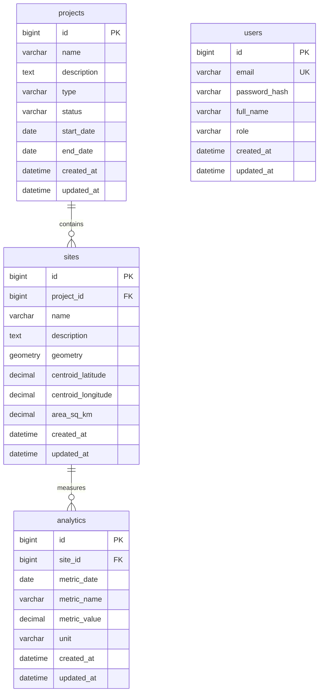

# Darukaa.Earth schema

This document describes the MySQL 8 relational model. It is **not** PostGIS.
Polygons use MySQL's built-in `GEOMETRY` type with **SRID 4326** (WGS84).

Product and API context: [`../README.md`](../README.md). Runtime flows: [`architecture.md`](architecture.md).

## How the layers fit

| Layer | What it is |
| --- | --- |
| Flyway SQL (`db/migration`) | Source of truth for tables, FKs, indexes |
| JPA **entity** | Java class mapped to one table |
| **Repository** | Spring Data interface used by services (`ProjectRepository`, `SiteRepository`, …) |
| Hibernate Spatial + JTS | Maps `sites.geometry` to `org.locationtech.jts.geom.Polygon` |

`spring.jpa.hibernate.ddl-auto` is `validate`: Hibernate checks entities against Flyway tables and does not create them.

## ER diagram

```text
users          (no FK to projects — shared catalog)
projects 1 ──< sites 1 ──< analytics
```

Authentication exists (`users` + JWT), but there is **no user↔project foreign key**. Every authenticated `ADMIN` shares one project catalog. That is a demo trade-off, not multi-tenant isolation.



## Tables

### users (`V1__create_users.sql`)

| Column | Type | Notes |
| --- | --- | --- |
| id | BIGINT AI PK | |
| email | VARCHAR(255) NOT NULL UNIQUE | Index `uk_users_email` |
| password_hash | VARCHAR(255) NOT NULL | Hash only; never log it |
| full_name | VARCHAR(255) NOT NULL | |
| role | VARCHAR(32) NOT NULL | `ADMIN`, `USER` |
| created_at / updated_at | DATETIME(6) | Set in JPA `@PrePersist` / `@PreUpdate` |

### projects (`V2__create_projects.sql`)

| Column | Type | Notes |
| --- | --- | --- |
| id | BIGINT AI PK | |
| name | VARCHAR(255) NOT NULL | |
| description | TEXT | |
| type | VARCHAR(64) | `BIODIVERSITY`, `CARBON`, `REFORESTATION`, `WATERSHED`, `COASTAL`; index `idx_projects_type` (V5) |
| status | VARCHAR(32) | `ACTIVE`, `PLANNING`, `COMPLETED`, `ON_HOLD`; index `idx_projects_status` |
| start_date / end_date | DATE NULL | Added in `V5__add_project_dates.sql`; JSON field is `projectType` for type |
| timestamps | DATETIME(6) | |

### sites (`V3__create_sites.sql`)

| Column | Type | Notes |
| --- | --- | --- |
| id | BIGINT AI PK | |
| project_id | BIGINT NOT NULL FK | `ON DELETE CASCADE`; index `idx_sites_project_id` |
| name | VARCHAR(255) | |
| description | TEXT NULL | Added in `V6__add_site_description.sql` |
| geometry | GEOMETRY NOT NULL SRID 4326 | Spatial index `idx_sites_geometry` |
| centroid_latitude / centroid_longitude | DECIMAL(10,7) | Filled by `GeometryConverter` from JTS centroid (lon/lat) |
| area_sq_km | DECIMAL(14,6) | Spherical trapezoidal area, IUGG mean radius 6371.0088 km |

Java field: `Site.geometry` as JTS `Polygon`, `@JdbcTypeCode(SqlTypes.GEOMETRY)`, Hibernate Spatial 6 + `MySQLDialect` (spatial dialects were merged in Hibernate 6).

### analytics (`V4__create_analytics.sql`)

| Column | Type | Notes |
| --- | --- | --- |
| id | BIGINT AI PK | |
| site_id | BIGINT NOT NULL FK | `ON DELETE CASCADE`; index `idx_analytics_site_id` |
| metric_date | DATE NOT NULL | Index `idx_analytics_metric_date` |
| metric_name | VARCHAR(64) | e.g. `NDVI` |
| metric_value | DECIMAL(16,6) | |
| unit | VARCHAR(32) | |
| unique | (site_id, metric_date, metric_name) | One value per metric per day per site |

`DemoDataSeeder` stores four mock metric names per month (`carbon`, `biodiversity`, `vegetation`, `performance`) and the API **pivots** those EAV rows into `{ carbonValue, biodiversityScore, vegetationIndex, performanceScore }`. Values are **generated demo data, not field measurements**. Canonical names and units: `com.darukaa.earth.analytics.AnalyticsMetrics`.

## Spatial notes (MySQL, not PostGIS)

- **Choice:** persist a real MySQL `GEOMETRY` column (SRID 4326) via Hibernate Spatial. Not JSON. Not a WKT `VARCHAR` as the primary column.
- JTS/GeoJSON order is **x = longitude, y = latitude**. MySQL 8 `ST_GeomFromText(..., 4326)` uses **lat/lon** axis order. Phase 5 persists via Hibernate Spatial WKB, not `ST_GeomFromText`.
- `GeometryConverter` accepts GeoJSON Polygon (or a Feature wrapping one) and rejects Point/LineString. Rings must be closed with at least 4 positions.
- Area formula: `area = |Σ (λᵢ₊₁ − λᵢ) · (sin φᵢ + sin φᵢ₊₁)| · R² / 2` with λ, φ in radians and holes subtracted. This is a spherical estimate for small plots, not a geodesic equal-area projection.
- Java types: `com.darukaa.earth.user.User`, `com.darukaa.earth.project.Project`, `com.darukaa.earth.site.Site`, `com.darukaa.earth.analytics.AnalyticsRecord`.
